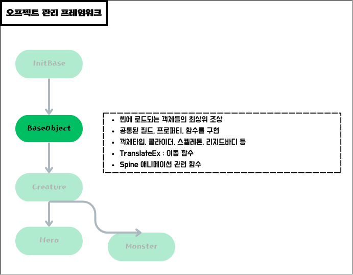

### 객체 관리 구조
</img> 

### 객체 관리 역할
</img> 

</img> 

---
#### Hero 객체를 스폰할 때 어드레서블에 프리팹을 하나씩 만들어 넣어야할까?
- Hero 객체를 구성하고 있는 컴포넌트는 모두 동일하다.
- Hero 종류에 따라 다르게 해야할 데이터는 이미지 정보(Spine)와 직업에 따른 체력, 공격력 등과 같은 데이터들뿐이다.
- 따라서 Hero 프리팹은 하나만 만들어 두고 다른 정보들만 채워넣고 스폰하는 방식을 택한다.