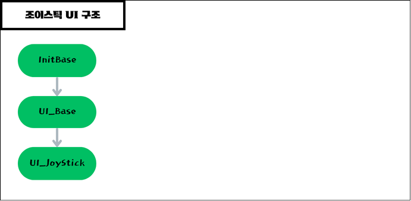
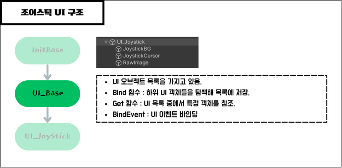
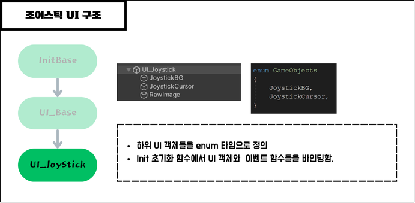
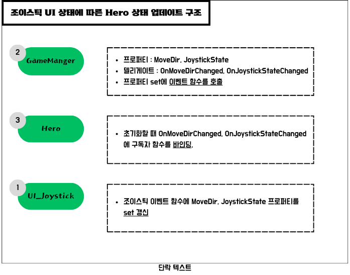

### 옵저버 패턴
> 옵저버 패턴은 객체의 상태 변화를 관찰하는 옵저버들을 두어 변화가 있을 때마다 주체가 옵저버들에게 알리는 디자인 패턴입니다. 이를 통해 객체 간의 결합도를 낮추고 유연한 상호작용을 가능하게 합니다.   
예를 들어, 플레이어가 적을 처치할 때 어떤 동작을 수행해야 하는 경우, UI 상태 업데이트, 퀘스트 상태 업데이트 등 에 옵저버 패턴을 활용할 수 있습니다.

### 조이스틱 UI 상태처리 구조
</img><br/>
</img><br/>
</img><br/>

### 조이스틱 UI 상태에 따른 Hero 상태 업데이트 구조
</img><br/>

### 옵저버 패턴 적용 코드 예시
```C#
//UI_Base.cs-----------------------------------------------------------------------------------
public static void BindEvent(GameObject go, Action<PointerEventData> action = null, Define.EUIEvent type = Define.EUIEvent.Click)
    {
        //이벤트 발생 여부를 구독자들에게 알려주는 주체가 있는 클래스
        UI_EventHandler evt = Utils.GetOrAddComponent<UI_EventHandler>(go);

        //구독자인 action을 주체와 바인딩한다.
        switch (type)
        {
            case Define.EUIEvent.Click:
                evt.OnClickHandler -= action;
                evt.OnClickHandler += action;
                break;
            case Define.EUIEvent.PointerDown:
                evt.OnPointerDownHandler -= action;
                evt.OnPointerDownHandler += action;
                break;
            case Define.EUIEvent.PointerUp:
                evt.OnPointerUpHandler -= action;
                evt.OnPointerUpHandler += action;
                break;
            case Define.EUIEvent.Drag:
                evt.OnDragHandler -= action;
                evt.OnDragHandler += action;
                break;
        }
    }

//UI_Joystick.cs : 상속받은 BindEvent 함수를 통해 구현한 함수를 주체와 바인딩--------------------------
public override bool Init()
    {
        if (base.Init() == false) return false;

        gameObject.BindEvent(OnPointerDown, EUIEvent.PointerDown);
        gameObject.BindEvent(OnPointerUp, EUIEvent.PointerUp);
        gameObject.BindEvent(OnDrag, EUIEvent.Drag);

        return true;
    }

    //구독자 함수들
    #region Event
    private void OnPointerDown(PointerEventData eventdata)
    {
        _background.transform.position = eventdata.position;
        _cursor.transform.position = eventdata.position;
        _touchPos = eventdata.position;

        Managers.Game.JoystickState = EJoystickState.PointerDown;
    }

    private void OnPointerUp(PointerEventData eventdata)
    {
        _cursor.transform.position = _touchPos;

        Managers.Game.MoveDir = Vector2.zero;
        Managers.Game.JoystickState = EJoystickState.PointerUp;
    }

    private void OnDrag(PointerEventData eventdata)
    {
        Vector2 delta = eventdata.position - _touchPos;

        float dist = Mathf.Min(delta.magnitude, _radius);
        Vector2 dir = delta.normalized;
        Vector2 newPos = _touchPos + dir * dist;

        _cursor.transform.position = newPos;

        Managers.Game.MoveDir = dir;
        Managers.Game.JoystickState = EJoystickState.Drag;
    }
    #endregion
```
> 이런 방식으로 UI를 조작하는 순간(클릭시작, 클릭종료, 드래그 ...)을 이벤트로 처리해 특정 순간에 대한 로직을 명확하고 유연하게 구현할 수 있음.